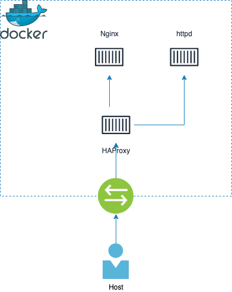

# lb-cloud-example

Example of working round robin mechanism in container area. This presents
simple load balancing between servers using popular solution which is HAProxy.


# Deployment
## Overview

** Local **
To run containers and test traffic run:
```
docker-compose --file docker-compose-local.yml up --detach
```

** From Docker Hub **
To run containers and test traffic run:
```
docker-compose up --detach
```

## Stack

* [Docker](https://docs.docker.com/engine/install/) - 19.03.0+
* [docker-compose](https://docs.docker.com/compose/install/) - 1.27.0+

## Details
* Definied subnet (172.28.0.0/24) in bridge mode
* Containers have static IPs
* Traffic is implemented for HTTP protocol

# Roadmap

If you are interested of next steps to provide full cloud explanation for load
balancing check [Issues](https://github.com/clistoq/lb-cloud-example/issues) in this repo.
